# Introduction

La présente documentation, à destination des développeurs, a pour objectif de présenter le détail du fonctionnement du processus de mise en cohérences des surfaces administratives aux frontières ainsi que les principaux outils mis en oeuvre.

# Installation

## Code source 

Le code source de l'application est disponible sur le dépôt [au_matching](https://github.com/openmapsforeurope2/au_matching.git)

## Dépendances 

L'installation de l'application nécessite la compilation préalable de bibliothèques internes et externes à l'IGN.

Voici le graphe des dépendances :

### Socle IGN 

Le socle logiciel de l'IGN regroupe un ensemble de bibliothèques développées en interne qui permettent d'unifier l'accès aux bibliothèques c++ de traitement et de stockage de données géographiques.
On y trouve notamment des modèles de données pivots (géométries, objet attributaire), des fonctions de lecture/écriture de conteneurs d'objets, des opérations sur les géométries, de nombreux algorithmes et outils spécifiquement conçus pour répondre à des problématiques géomaticiennes...

Le code source du socle ce trouve sur le dépôt [sd-socle](http://gitlab.forge-idi.ign.fr/socle/sd-socle.git)

### LibEPG 

Cette bibliothèque, développée à l'IGN et s'appuyant essentiellement sur le socle logiciel, contient de nombreux algorithmes et fonctions utilitaires dédiés spécifiquement aux besoins des produits européens (EGM/ERM) ainsi qu'au projet [OME2](https://github.com/openmapsforeurope2/OME2).
Elle comporte essentiellement des fonctions de généralisations, des fonctions utiles au management du processus tels que des utilitaires de log, d'orchestration, de gestion du contexte.
On y trouve également des opérateurs permettant d'encapsuler des objets géométriques complexes afin d'en optimiser la manipulation (par l'utilisation de graphes, d'indexes...) et ainsi d'accroitre les performances globales des processus.

Le code source de la bibliothèque libepg ce trouve sur le dépôt [libepg](https://github.com/IGNF/libepg.git)

# Fonctionnement du processus

Le traitement de mise en cohérence des surfaces administratives avec les frontières est lancé pour un pays. 
Cet outil doit être utilisé sur des tables de travail dans lesquelles sont extraites les unités administratives à traiter.
Si l'on désire ne mettre en cohérence qu'un sous-ensemble des unités administratives frontalières d'un pays (par exemple, celles bordant un ou plusieurs pays frontaliers particuliers), il suffit de n'extraire dans la table travail que les surfaces que l'on souhaite traiter.
Seul le plus petit échelon administratif doit être traité (le rang du plus petit échelon diffère selon le pays traité). Pour les autres échelons, les surfaces seront calculées par agrégation des surfaces de l'échelon inférieur.
A noter que l'échelon le plus petit est celui possédant le rang le plus haut (pouvant aller jusqu'à de 1 à 6 selon le pays). L'échelon le plus haut possède le rang 1, il correspond à l'emprise nationale.

## Principe général du traitement

Le processus de mise en cohérence des surfaces administratives est décomposé en une succession d'étapes clés.
Afin d'orchestrer l'enchainement de ces étapes l'application utilise l'outil **epg::step::StepSuite** de la bibliothèque **libepg**. Ce dernier permet de lancer une succession de **epg::step::Step** dans lesquels sont implémentés les traitements de chaque étape.
Un code (numéro à trois chiffres) est attribué à chaque étape. Les étapes sont ordonnancées selon cette numérotation. Si une étape transforme les données sur lesquelles elle travaille, une ou plusieurs tables dédiées préfixées du code de l'étape sont créées. Ces créations sont réalisées en copiant les tables d'une étape antérieure (qui n'est pas nécessairement l'étape immédiatement antérieure, car toutes les étapes ne travaillent pas sur les mêmes données).
Ce fonctionnement permet de conserver les résultats intermédiaires du processus. Cela donne la possibilité d'arrêter et de reprendre le traitement en cours de processus et facilite le travail de d'analyse et de deboggage.

Les étapes qui composent le traitement de raccordement sont les suivantes :

**610** - extraction des portions de contour de l'emprise nationale correspondant à des côtes
 
**620** - extraction des portions de contour de l'emprise nationale qui ne sont pas des côtes
 
**630** - mise en cohérence des unités administratives bordant les portions du contour national qui ne sont pas des côtes

L'outil **epg::step::StepSuite** donne la possibilité de ne lancer que certaines étapes ou une plage de plusieurs étapes.

## Configuration

L'outil s'appuie sur de nombreux paramètres de configuration permettant d'adapter le comportement des algorithmes en fonctions des spécificités nationales (sémantique, précision, échelle, conventions de modélisation...).

On trouve dans le [dossier de configuration](https://github.com/openmapsforeurope2/au_matching/tree/main/config) les fichiers suivants :

- epg_parameters.ini : regroupe des paramètres de base issus de la bibliothèque libepg qui constitue le socle de développement l'outil. Ce fichier est aussi le fichier chapeau qui pointe vers les autres fichiers de configurations.
- db_conf.ini : informations de connexion à la base de données.
- theme_parameters.ini : configuration des paramètres spécifiques à l'application.

## Lancement du traitement

L'outil s'utilise en ligne de commande.

Paramètres :

* c [obligatoire] : chemin vers le fichier de configuration
* s [obligatoire] : suffix de la table de travail
* sp [optionnel] : étape(s) à executer (exemples: 610 ; 610,620 ; 610-630)
* argument libre [obligatoire] : code pays

 

Exemple d'appel pour lancer l'ensemble des étapes:
~~~
bin/au_matching --c path/to/config/epg_paramaters.ini --s 20260519 fr
~~~

Exemple d'appel pour ne lancer qu'une seule étape :
~~~
bin/au_matching --c path/to/config/epg_paramaters.ini --s 20260519 --sp 620 fr
~~~

## Les étapes - fonctionnement détaillé

### 610 : InitLandmaskCoast

Dans cette étape nous procédons à l'extraction dans une table dédiée des linéaires correspondant aux parties littorales du contour de l'emprise nationale.

#### Données de travail :

| table                          | entrée | sortie | entitée de travail | description                                                 |
|--------------------------------|--------|--------|--------------------|-------------------------------------------------------------|
| LANDMASK_TABLE                 | X      |        |                    | table des emprises nationales                               |
| TARGET_BOUNDARY_TABLE          | X      |        |                    | table des frontières                                        |
| COAST_TABLE                    |        | x      |                    | table des portions littorales du contour national           |

#### Principaux opérateurs de calcul utilisés :
- app::calcul::InitLandmaskCoastOp

#### Description du traitement :
Paramètre utilisés: 
| paramètre                       | description                                                                                                                                 |
|---------------------------------|---------------------------------------------------------------------------------------------------------------------------------------------|
| BOUNDARY_TYPE                   | champ de la table des frontières spécifiant le type de frontière                                                                            |
| TYPE_COASTLINE                  | valeur pour le champ BOUNDARY_TYPE désignant une frontière maritime                                                                         |
| AU_COAST_MAX_DIST               | écart maximum autorisé entre la côte (frontière maritime) et son chemin associé sur le contour de l'emprise nationale                       |
| AU_COAST_SEARCH_DIST            | distance maximum autorisé entre les extrémités d'une côte et le contour de l'emprise nationale pour lancer la recherche d'un chemin associé |
| AU_COAST_SNAP_DIST              | distance maximum d'accrochage des extrémités du chemin associé à la côte aux points du contour extérieur (polyligne) de l'emprise nationale |

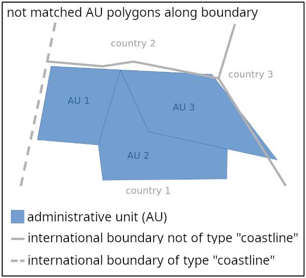

Dans un premier temps on créé la table _COAST_TABLE_ dédiée à ce traitement. Le nom de cette table est la concaténation du nom de la table _AREA_TABLE_INIT_ (table de travail contenant les surface administratives à traiter) avec le suffix _COAST_TABLE_SUFFIX_.
Il nous faut également, pour les besoins du traitement, charger l'outil __epg::tool::MultiLineStringTool__ avec la géométrie du contour de l'emprise nationale (nous utilisons l'emprise nationale correspondant au millésime actuel, et, qui coincide donc géométriquement avec les surfaces administratives à traiter). Cet outil permet de gérer des géométries complexes en les décomposant en sous-géométries plus petites indexées spatialement.

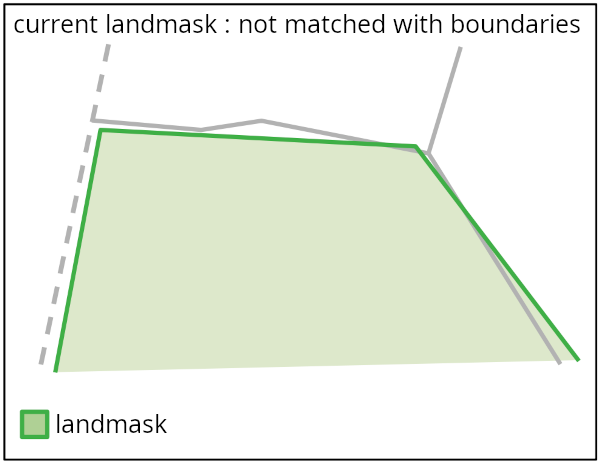

On parcourt ensuite les frontières correspondant à des côtes (objets de la table _TARGET_BOUNDARY_TABLE_ dont la valeur du champ _BOUNDARY_TYPE_ est _TYPE_COASTLINE_) dans le but de fusionner l'ensemble de ces géométries afin d'agréger les ensembles contigus de côtes.
On peut maintenant parcourir ces côtes agrégées et pour chacun de ces objets on calcule, grâce à l'outil __epg::tool::MultiLineStringTool__ préalablement chargé, le chemin sur le contour de l'emprise nationale longeant sa géométrie et ayant pour points de départ et d'arrivé la projection sur le contour national de ses extrémités. Si un chemin a pu être calculé il est enregistré dans la table _COAST_TABLE_.

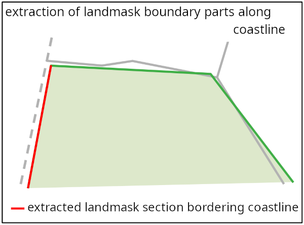

### 620 : InitLandmaskNoCoast

Le travail consiste ici à calculer les parties non littorales du contour de l'emprise nationale, c'est à dire dégager les parties complémentaires des parties littorales du contour calculées à l'étape précédente.

#### Données de travail :

| table                          | entrée | sortie | entitée de travail | description                                                 |
|--------------------------------|--------|--------|--------------------|-------------------------------------------------------------|
| LANDMASK_TABLE                 | X      |        |                    | table des emprises nationales                               |
| COAST_TABLE                    | x      |        |                    | table des portions littorales du contour national           |
| NOCOAST_TABLE                  |        | x      |                    | table des portions non littorales du contour national       |

#### Principaux opérateurs de calcul utilisés :
- app::calcul::InitLandmaskNoCoastOp

#### Description du traitement :
Paramètre utilisés: 
| paramètre                       | description                                                                                                                                 |
|---------------------------------|---------------------------------------------------------------------------------------------------------------------------------------------|
| LAND_COVER_TYPE                 | champ de la table des emprises nationales spécifiant le type couverture du sol                                                              |
| TYPE_LAND_AREA                  | valeur pour le champ LAND_COVER_TYPE désignant une superficie terrestre                                                                     |

Une étape préliminaire consiste à récupérer les polygones représentant les parties de l'emprise nationale dont le type _LAND_COVER_TYPE_ est _TYPE_LAND_AREA_ et de les raffiner en ajoutant, le cas échéant, les extrémités des parties littorales contenue dans la table _COAST_TABLE_ si ces dernières n'ont pas été accrochées aux points de la polyligne du contour de l'emprise nationale (lors de la recherche des chemins sur le contour longeant les frontières littorales à l'étape précedente).
On peut alors extraire les parties du contour national qui sont complémentaires des parties littorales précédemment enregistrées dans la table _COAST_TABLE_. Ces polylignes représentant les parties non-littorales du contour national sont enregistrées dans la table _NOCOAST_TABLE_.

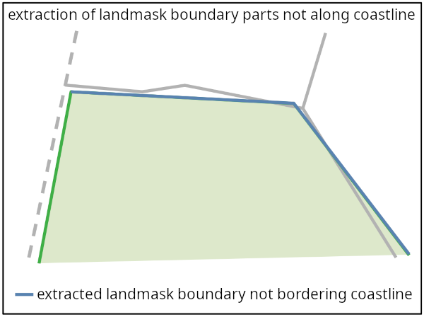

### 630 : AuMatching

Après avoir extrait les parties des contours de l'emprise nationale correspondant à des limites non littorales, le travail consiste maintenant, à partir de ces données, à identifier les parties des contours des unités administratives correspondant à des limites internationales non littorales et à les remplacer par des portions de frontière calculées à partir des objets linéaires contenus dans la table des frontières internationales.

#### Données de travail :

| table                          | entrée | sortie | entitée de travail | description                                                 |
|--------------------------------|--------|--------|--------------------|-------------------------------------------------------------|
| LANDMASK_TABLE                 | X      |        |                    | table des emprises nationales                               |
| TARGET_BOUNDARY_TABLE          | X      |        |                    | table des frontières                                        |
| NOCOAST_TABLE                  | x      |        |                    | table des portions non littorales du contour national       |
| AREA_TABLE_INIT                | x      | x      | x                  | table des unités administratives de plus petit échelon      |

#### Principaux opérateurs de calcul utilisés :
- app::calcul::AuMatchingOp

#### Description du traitement :
Paramètre utilisés: 
| paramètre                       | description                                                                                                                                 |
|---------------------------------|---------------------------------------------------------------------------------------------------------------------------------------------|
| BOUNDARY_TYPE                   | champ de la table des frontières spécifiant le type de frontière                                                                            |
| TYPE_COASTLINE                  | valeur pour le champ BOUNDARY_TYPE désignant une frontière maritime                                                                         |
| AU_BOUNDARY_MAX_DIST            | écartement maximum entre un contour fermé d'une unité administrative en accostage avec l'emprise nationale et la frontière pour qu'une mise en cohérence puisse être réalisée |
| AU_BOUNDARY_SEARCH_DIST         | écartement maximum autorisé entre une portion de contour administratif en accostage avec l'emprise nationale et la frontière pour qu'une mise en cohérence puisse être réalisée |
| AU_BOUNDARY_SNAP_DIST           | distance d'accrochage aux points intermédiaires de la frontière lors du remplacement de portions de contour administratif par des portions de frontière |
| AU_SEGMENT_MIN_LENGTH           | longueur minimum des segments des contours de l'unité administrative |

Le traitement débute par une phase préparatoire d'enregistrement en mémoire et d'indexation des données afin accélérer les calculs:
- l'ensemble des segments des polylignes de la table _NOCOAST_TABLE_ sont indexés dans un même objet _app::tools::SegmentIndexedGeometryCollection_. Au sein de cet objet les segments appartenants au même contour sont marqués avec un numéro de groupe identique: tous les segments des polylignes ouvertes sont marqués comme appartenant au même groupe et on attribut à chaque polyligne fermée un numéro de groupe unique qui est affecté à chacun de ses segments.
- on merge l'ensemble des frontières du pays issues de la table _TARGET_BOUNDARY_TABLE_. On transforme ainsi les frontières du pays en un ensemble de contours fermés. Chacun de ces contours est indexé spatialement de manière globale par son envelope et également de manière détaillée puisqu'un objet _app::tools::SegmentIndexedGeometry_ indexant l'ensemble des segments est instancié pour chacun d'entre eux.

On parcourt ensuite les unités administratives frontalières et on applique à chacune d'entre elles le traitement décrit ci-après.
On raffine la géométrie (multi-polygone) de l'unité administrative en ajoutant des points intermédiaires correspondants aux extrémités des polylignes ouvertes issues de la table _NOCOAST_TABLE_ avec lesquelles elle est en contact.
On instancie un opérateur _ign::geometry::algorithm::PolygonBuilderV1_ permettant de construire un polygone à partir d'un ensemble de contours fermés. Ensuite, on parcourt l'ensemble des contours de chaque polygone du multi-polygone de l'unité administrative. Chaque contour, le cas écheant, est transformé afin d'assurer sa mise en cohérence avec la frontière. A l'issu de leur traitement les contours sont ajoutés dans l'opérateur _ign::geometry::algorithm::PolygonBuilderV1_, puis une fois que tous les contours ont été parcourus cet opérateur nous permet de recontruire la géométrie de l'unité administrative (multi-polygone) raccordée aux frontières.
Voici le détail du traitement réalisé sur chacun des contours :
    Dans un premier temps, on extrait les parties du contour qui ne sont pas en contact avec les parties non-cotières du contour de l'emprise nationale (objets de la table _NOCOAST_TABLE_). Cela est rendu possible par le fait que la géométrie de l'emprise nationale est en accostage parfait avec les unités administratives frontalières puisque issue du même millésime.

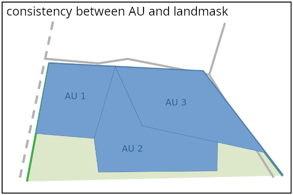
    
    Sont extraits également les localisations des contacts ponctuels des contours des unités administratives avec le contour de l'emprise nationale car il faudra que ce contact soit maintenu lors de la mise en cohérence.

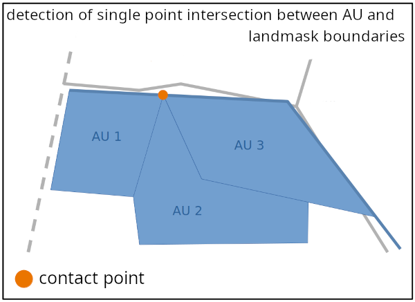

    - Si le contour est entièrement en contact avec les parties non-cotières du contour de l'emprise nationale c'est qu'il s'agit d'une boucle (exclave, enclave, île). Dans ce cas la mise en cohérence consistera simplement à remplacer ce contour d'unité administrative par le(s) contour(s) fermé(s) de frontière correspondant(s). Il nous faut donc identifier le(s) meilleur(s) candidat(s) parmis les contours fermés de frontières préalablement indexés. Pour cela on parcourt tous les contours fermés de frontière proches (ceux dont l'envelope touche l'envelope du contour d'unité administrative) et pour chacun d'entre eux on calcule la demi-distance de Hausdorff du contour d'unité administrative vers le contour de frontière. Si cette distance est supérieure à _AU_BOUNDARY_MAX_DIST_ alors on calcule la demi-distance de Hausdorff inverse et si celle-ci est également supérieur au seuil on considère que la correspondance n'est pas établie. Dans le cas contraire ou l'une des deux distance est inférieure au seuil un lien est établi entre le contour d'unité administrative est le contour de frontière. Cette manière de procèder en séparant les calculs des deux demi-distance de Hausdorff permet le cas échéant d'établir des correspondances n-1 ou 1-n entre les contours administratifs est les contours de frontières. En effet, un contour administratif peut se voir associé à plusieurs contours de frontières, ou, inversement, plusieurs contours administratifs peuvent être associé à un même contour de frontière.

    - Si le contour possède des parties qui ne sont pas en contact avec les parties non-cotières du contour de l'emprise nationale, on réalise les traitements décrits ci-après.
    Tout d'abord, on transforme le contour de l'unité administrative en déplaçant ses points intermédiaires touchant le contour de l'emprise nationale, calculés précédemment (contacts ponctuels détectés lors de l'extraction les parties du contour qui ne sont pas en contact les parties non-cotières du contour de l'emprise nationale), sur la frontière afin que ce contact soit maintenu et assurer la cohérence entre les géométries des unités administratives adjacentes après leur raccordement aux frontières. L'opérateur calculant le déplacement du point de contact recherche une projection dont la distance n'excède pas _AU_BOUNDARY_SEARCH_DIST_ et assure l'accrochage à un point intermédiaire de la frontière qui serait à une distance inférieure à _AU_BOUNDARY_SNAP_DIST_ du point projeté.

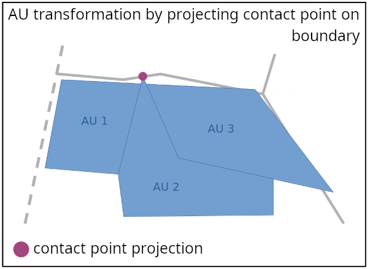

    On extrait de ce contour, transformé au niveau des points contacts avec la frontière, les géométries des parties qui ne sont pas en contact avec les parties non-cotières du contour de l'emprise nationale (ces parties étant définies par les indexes des points intermédiaires du contour correspondant à leurs extrémités).
        - S'il n'existe qu'une seule partie et que c'est une polyligne fermée cela signifie que c'est un contour administratif qui n'est pas en accostage avec les parties non-cotières du contour de l'emprise nationale (mais qui peut éventuellement être en contact ponctuel). Dans ce cas le contour est conservé tel quel (avec les éventuelles transformations au niveau de contacts ponctuels).

        - Sinon, nous sommes dans le cas ou le contour possède des parties qui sont en contact avec les parties non-cotières du contour de l'emprise nationale et d'autres qui ne le sont pas. 

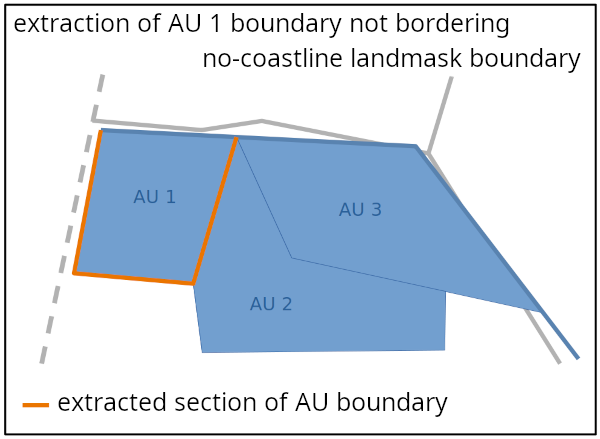

        Il nous faut dans ce cas remplacer les parties en contact avec le contour de l'emprise nationale par les portions de frontière idoines.
        Pour cela, on parcourt les parties qui ne sont pas en accostage avec le contour de l'emprise nationale. A noter que l'on a obligatoirement une alternance de parties en accostage et de parties qui ne le sont pas, les parties qui ne sont pas en accostage ont donc leurs deux extrémités en contact avec le contour de l'emprise nationale.
        Afin de caractériser les points de contact entre les parties qui ne sont pas en accostage et le contour de l'emprise nationale on mesure les angles formés par le contour de l'emprise nationale au niveau de ces points.
        Les parties qui ne sont pas en accostage qui croisent la frontière sont découpés selon la frontière et les parties découpés situées aux extrémités (overshots) sont supprimés. Si la géométrie résultant de cette découpe présente des segments de longueur inférieure à _AU_SEGMENT_MIN_LENGTH_ au niveau des extrémités tronquées, ces segments sont fusionnés avec leur segment adjacent.
        Il nous faut maintenant chercher sur les frontières les points intermédiaires correspondant aux points de contact entre les parties qui ne sont pas en accostage et le contour de l'emprise nationale. Pour cela on projette tout d'abord les extrémités des parties qui ne sont pas en accostage sur la frontière, puis on recherche dans un rayon de _AU_BOUNDARY_SNAP_DIST_ autour de ce point de référence quel est le point intermédiaire de la frontière qui constitue le meilleur candidat. Afin d'évaluer chaque point intermédiaire on attribut à chacun un score dépendant de l'éloignement au point de référence et de la différence entre l'angle de référence mesuré sur le contour de l'emprise nationale et l'angle que forme la frontière au niveau de ce point.
        Si un candidat est identifié, il est projeté sur la partie de contour d'unité administrative concernée, cette partie de contour est ensuite découpée selon ce point projeté, puis l'extrémité tronquée est déplacée vers le candidat.

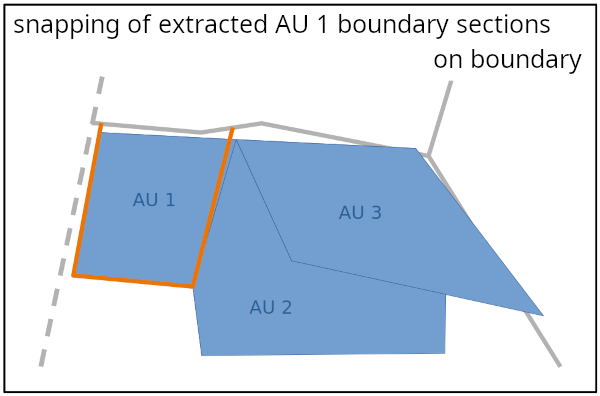

        Maintenant que le partie du contour de l'unité administrative qui ne sont pas en accostage avec les limites internationales ont été connectée aux frontières on peut reconstituer le contour de l'unité administrative en remplaçant les partie en accostage par des portions de frontière situées entre les extémités des parties qui ne sont pas en accostage. Pour cela nous utilisons la fonction epg::tools::MultiLineStringTool::getPathAlong qui permet de rechercher un chemin sur les frontières situé entre deux points (ici les extrémités des parties qui ne sont pas en accostage) et qui s'écarte le moins possible d'une géométrie de référence. Ici la géométrie de référence est la polyligne correspondant à la partie en accostage du contour de l'emprise nationale. Le fait de chercher un chemin le long d'une géométrie de référence permet de parcourir le bon chemin sur la frontière s'il s'agit d'un trou (donc d'un contour fermé). 
        __Important__ : si la frontière s'écarte de plus du seuil _AU_BOUNDARY_SEARCH_DIST_ de la géométrie de référence, le traitement du contour concerné est abandonné et un message du type "Error constructing ring [id] <administrative_unit_id>" est inscrit dans le fichier de log. Il revient à l'utilisateur de vérifier à l'issu du traitement si de tels messages apparaissent. Si tel est le cas, l'utilisateur devra mesurer l'écartement maximum entre les unités administratives dont l'identifiant apparait dans le log et la frontière. Il faudra ensuite adapter le paramètre _AU_BOUNDARY_SEARCH_DIST_ pour le pays concerné en choisissant une valeur supérieure à l'écartement maximum mesuré. Enfin, le traitement devra être relancé et il faudra s'assurer que le message précédemment indiqué n'apparait plus dans le fichier de log.

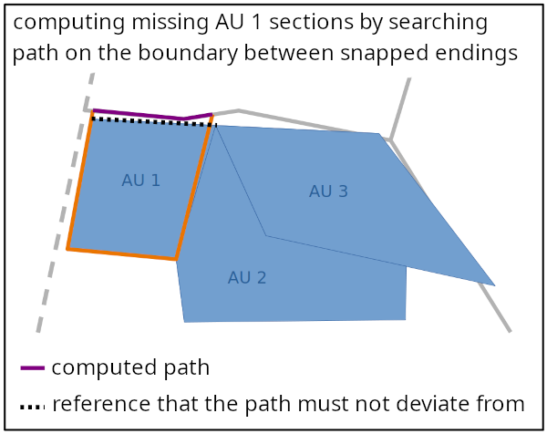
 
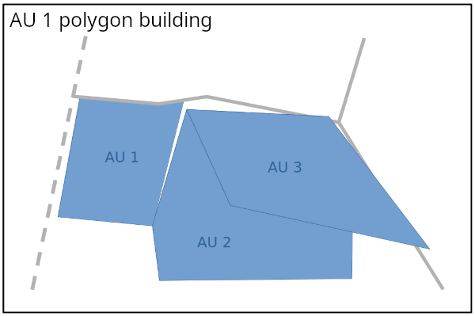
 
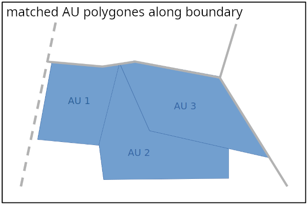